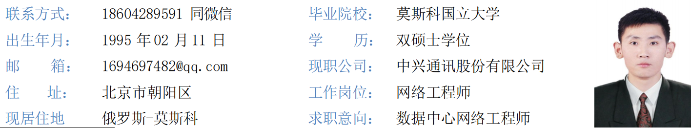

迟庆元-数据中心网络工程师简历

---

迟庆元-数据中心网络工程师简历（GitHub版）

---

📋 目录（点击快速跳转）

- [个人优势](#personal-advantage)

- [专业技能](#skills)

- [工作经历](#experience)

- [项目经历](#projects)

- [教育经历](#educations)

- [资格证书](#certifacations)

---

## 🎯 个人优势 {#personal-advantage}

1. 学历与技术功底：211理科实验班专业第一名，获两年国家奖学金；QS前100双硕士，精通VXLAN+EVPN+SDN+Clos网络模型，成功交付3个大型数据中心网络和1套城域网。

2. 从业经验：中兴通讯网络工程师6年，其中2年专注城域网设计、建设、割接、运维，4年聚焦数据中心网络与云计算运维改造、设计扩容，管理过总容量1600G的3个数据中心。

3. 核心技术：精通网络L2/L3技术，熟练掌握IaaS、NFV架构，可独立管理基础网络、存储业务网络；熟练运用OpenStack各组件，尤其精通Neutron在计算、存储场景的应用；擅长VXLAN隧道、EVPN、OpenFlow、Spine-Leaf架构、SDN控制器及Overlay-Underlay配置与优化。

4. 技术创新：结合VUE+Node.js、Python技术，研发“AI对话自动化生成Spine-Leaf数据中心网络”工具，可根据业务名称自动检索网络路径，获评公司“数字员工”优秀案例，成果已上传至个人GitHub，实现AI技术赋能网络运维。

5. 项目管理与沟通：担任技术负责人（TD）及公司合规经理，具备清晰逻辑思维与高效沟通协作能力，可协调客户、本地工程师完成项目交付。

6. 资质与学习能力：持有双硕士学历、软考网络工程师证书，获评公司云计算与虚拟化高级工程师、数通高级工程师，持续深耕技术领域，紧跟行业前沿。

7. 外语能力：负责海外项目，具备流利的中俄英三语沟通能力，可在多语言环境中解决技术难题，完成客户侧网络规划、交换机配置、网络维护等工作。

---

## 🛠️ 专业技能{#skills}

- 网络核心技术：深耕数据中心网络领域，精通VXLAN、EVPN、SDN、MPLS-VPN、负载均衡、OpenFlow、Spine-Leaf、Overlay-Underlay等主流技术；精通网络L2、L3全栈协议，可独立完成数据中心网络架构定制化设计、部署实施与迭代优化，精准匹配业务承载需求，保障系统高可用性与稳定性。

- 云计算与虚拟化：熟练掌握IaaS、NFV虚拟化架构，精通OpenStack全组件运维，尤其擅长Neutron组件在计算、存储场景的深度应用，可独立搭建、调优基础网络与存储业务网络，实现网络资源灵活调度与精细化管控。

- 编程与工具开发：熟练掌握Python、JavaScript编程语言，具备脚本开发与工具自研能力；熟悉VUE+Node.js前后端技术，可通过技术创新提升运维效率，自主研发的AI运维工具获评公司优秀案例。

- 项目与合规管理：具备大型网络项目落地实战经验，擅长架构设计、故障排查与优化；掌握项目成本管控、风险防控与合规管理要点，熟知通信行业政策标准及相关法律法规，可统筹推进项目全流程落地。

- 综合能力：具备流利的中俄英三语沟通能力，可独立对接海外客户，完成技术对接与问题解决；具备团队领导、跨部门协作能力，可带领团队高效完成运维、项目建设等各项任务。

---

## 💼 工作经历 {#experience}

中兴通讯股份有限公司 | 网络工程师 | 2020.08-至今

核心工作概述

深耕网络技术领域6年，覆盖城域网、数据中心、云计算三大核心板块，技术功底扎实，实践经验丰富。其中，前2年专注于城域网全流程工作，深度参与网络设计、工程建设、业务割接、日常运维等各项工作，熟悉城域网组网架构、业务流转逻辑及故障应急处置，积累了深厚的基层网络运维与建设经验；后4年聚焦数据中心网络与云计算领域，主攻运维改造、架构设计、规模扩容等核心工作，全程牵头管理总容量达1600G的3个大型数据中心，统筹把控数据中心从架构搭建、设备部署到运维优化、业务扩容的全生命周期，具备大型数据中心全流程管控与技术攻坚能力。同时兼任公司合规经理与项目技术负责人，联动客户、本地工程师高效推进海外项目交付。

核心工作成果

1. 数据中心架构设计与优化：面对业务量持续激增、用户访问量翻倍增长的运维压力，牵头主导设计创新型数据中心网络架构，全面引入SDN控制器搭建智能化管控体系，实现网络流表化、精细化统一管理，高效破解DC3数据中心运维复杂、扩容滞后、资源调度不畅的核心难题。依托专业仿真工具开展精准流量测算、架构模拟与压力测试，系统性优化网络转发路径、疏通流量瓶颈，实现数据中心算力、存储、带宽等核心资源的均衡分配与高效利用，大幅提升网络吞吐效率与数据转发速率，保障高并发场景下业务平稳运行。同时结合自身掌握的高级网络技术，对Spine-Leaf架构、Overlay-Underlay网络进行定制化优化，贴合业务扩容需求，提升网络扩展性与容错率。

2. 项目管理与执行：作为项目技术总监，统筹把控项目全流程，带领技术团队完成3座总容量1600G的大型数据中心，从传统OpenFlow模式向先进EVPN模式的扩容升级改造工作。全程深度参与项目顶层规划，牵头完成设备选型研判、方案定稿、风险预判、进度管控等关键环节，统筹协调施工部署、联调测试、上线割接等全流程工作，严守项目工期与质量标准，顺利完成全部改造项目的按期交付、平稳上线，无重大故障与安全隐患，圆满达成技术升级目标，全面提升数据中心网络承载能力与运行稳定性。

3. 技术设备配置与部署：带领专项技术团队，完成vFM、vGNAT核心设备的全新部署、参数调试与精细化配置工作，为网络虚拟化、业务弹性拓展筑牢硬件基础。牵头推进2座数据中心的规模化扩容改造工程，全程监督、严格把控硬件设备部署质量，共计完成260台核心交换机调试部署、3台服务器备份控制节点搭建、1000余台计算节点安装调试与联调工作，严把各环节关口，保障设备稳定运行、集群协同高效，支撑数据中心各项业务稳定承载、高效运转。

4. 跨部门协作与沟通：主动对接NFVO专项团队，建立常态化联动、高效协同的合作机制，打通技术对接、信息共享、问题联动处置的闭环流程，携手完成虚拟机规格配置、资源调度、业务上线割接等多项重点工作，平稳支撑日均约600万会话的稳定运行，保障业务并发处理能力与传输稳定性。搭建技术团队与业务团队的高效沟通桥梁，精准对接前端业务需求，同步反馈后端技术支撑能力，高效解决需求落地中的各类技术问题，全力保障业务顺畅落地。

5. 性能评估与风险管理：建立常态化运维巡检机制，定期对各数据中心开展全方位性能评估、压力测试与系统性风险排查分析，覆盖网络带宽、设备负载、算力利用率、数据安全、运行稳定性等多个维度，精准排查潜在故障隐患与性能短板。针对排查出的问题，制定针对性强、可落地的优化改进方案，牵头推进整改落地，持续优化数据中心运行效能，为各类新增业务、拓展业务的顺利上线提供坚实可靠的底层支撑。同时严守合规管理要求，落实公司各项运维规范，规避项目运行、网络运维中的各类合规风险。

6. 技术选型与升级建议：紧盯智算领域前沿技术、行业发展趋势与国家相关技术标准，深耕数据中心技术迭代方向，持续调研主流硬件、新型架构、运维技术的落地可行性。结合现有业务运行现状、未来业务拓展规划与成本管控要求，为数据中心长期建设、核心技术选型、版本迭代升级提供专业、可行的技术方案与决策建议，确保数据中心技术架构适配长期业务增长、规模拓展的发展需求，避免技术迭代断层与重复建设。

7. 技术文档编写与维护：全面负责数据中心全生命周期的技术文档编撰、修订与规范化管理工作，梳理编制架构设计规范、设备操作手册、日常运维指南、故障处置预案、项目竣工资料等全套技术文档，细化各项操作流程、技术参数、运维要点与应急流程。搭建标准化文档体系，为团队日常运维、故障排查、新人培训、项目复盘提供权威、便捷的技术参考，保障各项工作标准化、规范化推进。

8. 团队领导与个人提升：制定清晰的团队分工、绩效考核与目标管控机制，充分调动团队成员工作积极性与专业能动性，带领技术团队高效完成各项运维保障、项目建设、技术改造任务。自主研发“AI对话自动化生成Spine-Leaf数据中心网络”工具，获评公司“数字员工”优秀案例，相关成果已上传至个人GitHub。坚持自主深造，取得双硕士学历，考取多项专业资质，用专业实力印证技术能力。

核心业绩

- 完成1.6T双数据中心落地交付，担任2个数据中心网络扩容总工程师，主导整体框架设计与实施方案制定。

- 研发AI运维工具，结合AI+VUE+Python技术提质增效，获评公司“数字员工”优秀案例，成果上传至个人GitHub。

- 编写优质技术文档并分享，获得同事广泛好评；负责客户验收测试与技术培训，获得客户高度认可。

- 高效处理大量网络故障，保障网络安全稳定运行，支撑业务顺畅开展，无重大故障发生。

---

## 📈 项目经历 {projects}

俄罗斯代表处有线项目产品运维项目群 | 技术总监 | 2022.12-至今

- 负责固网GPON、DWDM及机顶盒运维等多个有线产品项目，协调各方资源，制定详尽的项目计划，有效控制项目进度与风险。

- 高效处理各类网络故障和客户需求，确保网络的稳定与高效运行，深入理解通信产品与软件开发流程，提升项目交付质量。

俄罗斯Beeline DC1&2&3虚拟化项目 | 数据中心网络技术工程师 | 2022.06-至今

项目背景

在数字化转型的浪潮中，BeeLine网络虚拟化项目面临着前所未有的挑战。随着业务量的爆炸性增长，现有的数据中心资源捉襟见肘，迫切需要进行大规模的运维扩容，以支持更多的业务上线和确保服务的连续性和稳定性。

项目目标

作为项目技术总监，领导团队完成DC3和DC2/DC1的运维扩容改造，优化网络架构，提升数据中心的处理能力，确保项目按时按质完成，满足业务发展需求。

关键行动

- 架构设计：主导设计创新的网络架构，采用SDN控制器实现流表化管理，提高网络灵活性与资源利用率。

- 设备配置与部署：带领团队完成vFM和vGNAT设备的新建和配置，监督DC2和DC1扩容改造，完成260台交换机、3台服务器备份控制节点、1000多台计算节点的部署工作。

- 跨部门协作：与NFVO团队建立紧密合作关系，共同完成虚拟机配置和业务上线，管理约600万的会话数，实现技术与业务团队无缝沟通。

- 性能评估与风险管理：定期对数据中心进行性能评估和风险分析，提出多项改进措施，持续提升服务质量与数据中心稳定性。

项目成果

顺利完成DC3和DC2/DC1的运维扩容，提升网络稳定性和效率，支撑更多业务顺利上线，显著提高客户满意度；充分展现战略规划、架构设计、项目管理和团队领导能力，推动企业数字化转型。

俄罗斯某州IPBH项目 | 技术总监 | 2020.08-2022.06

- 负责俄罗斯某州IPBH网络swap项目，涉及270个站点替换，规模较大、实施难度较高。

- 运用MPLS-VPN技术，实现一张城域网同时承载基站回传业务与政企服务，大幅提升网络利用率与业务承载能力，获得客户认可。

俄罗斯布良斯克IPBB项目 | 技术总监 | 2020.12-2022.04

- 负责俄罗斯布良斯克城域网swap异厂商设备项目，涉及260多个站点，需解决异厂商设备兼容、调试等核心难题。

- 运用MPLS-VPN技术，完成城域网改造与优化，保障网络稳定运行与业务顺畅承载，按时完成项目交付。

---

## 🎓 教育经历 {#educations}

- 北亚利桑那大学 | 软件工程 | 硕士 | 2024-2025

- 莫斯科国立大学 | 地球信息科学 | 硕士 | 2018-2020

- 中国石油大学(华东) | 石油工程 | 本科 | 2014-2018

---

## 📜 资格证书 {#certifacations}

- 软考：网络工程师高级证书、计算机软考网络工程师中级证书

- 云计算与虚拟化：云平台虚拟化中级证书、CKA管理员认证、云计算工程师证书

- 网络技术：HCIP-DCN、高级网络工程师证书、中级职称

- 语言：对外俄语二级、英语四六级

- 其他：中国工程师联合体通信学会会员、欧美同学会会员、网络工程师证书

